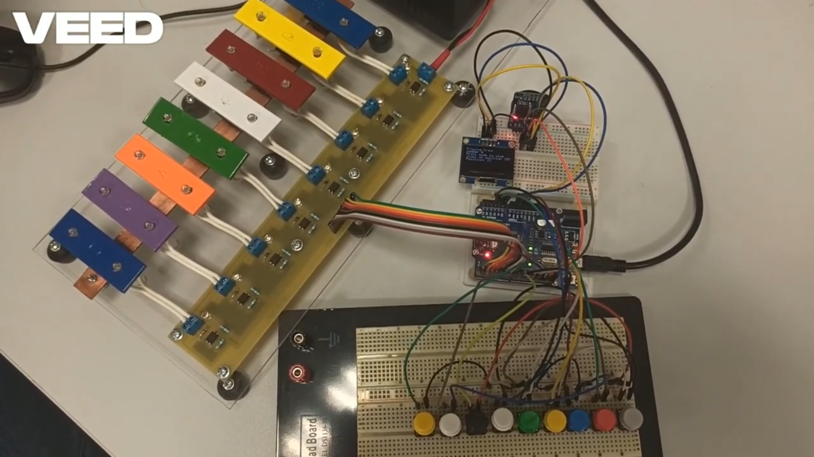
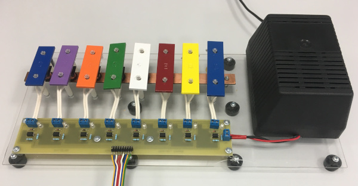
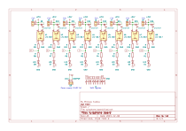
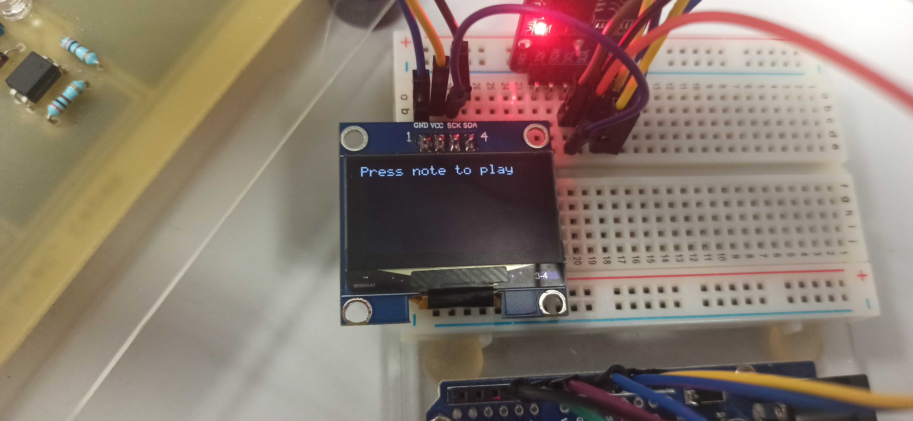
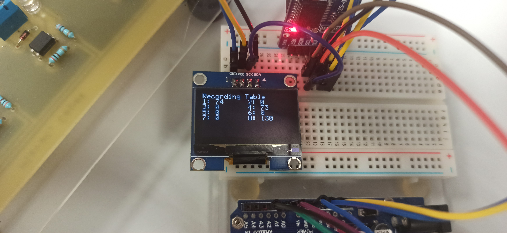
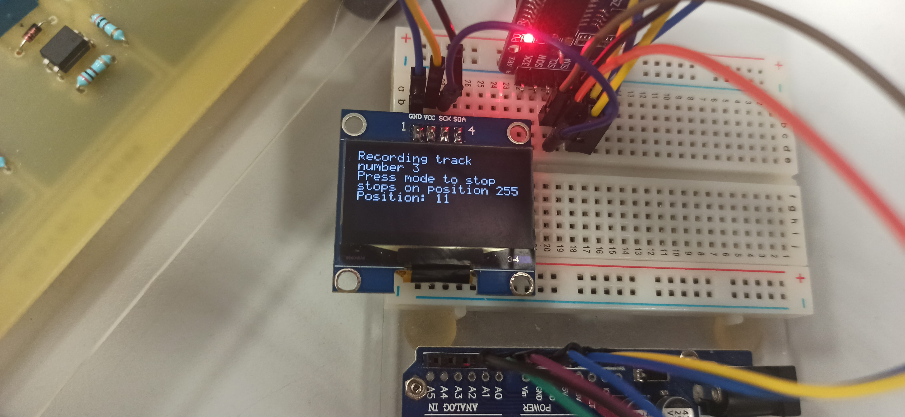

# Digitální elektronika 2 projekt

## Elektronicky ovládaný xylofon


### Team members

* Jakub Švaříček – debouncing, zpracovaní video ukázky;
* Vojtěch Šolc – main soubor;
* Ondřej Zikán – paměťový prvek EEPROM;
* Viktoriia Shishkova – implementace obrazovky, readme soubor.

## Zadaní projektu:
Vytvořte elektronický xylofon, na který se dá hrát pomocí AVR mikrokontroléru. Projekt bude kombinovat harwarové a softwarové komponenty pro vytvoření interaktivního and programovatelného hudebního nástroje schopného vydávat různé tóny a melodie. Začlenění grafického uživatelského rozhraní (GUI) pro vizualizaci přehrávaných not.

## Teoretický úvod
Tento projekt je zaměřen na návrh a realizaci elektronického xylofonu využívajícího AVR mikrokontrolér. Hlavním cílem projektu je vytvořit nástroj, který umožní přehrávání hudby, skladbu melodií a vizualizaci not prostřednictvím grafického uživatelského rozhraní (GUI). AVR mikrokontrolér zde bude plnit roli centrální jednotky, která zpracovává vstupy od uživatele a generuje odpovídající zvukové výstupy.
AVR je rodina mikrokontrolérů vyvinutá společností Atmel, jsou široce používány v embedded systémech, vývojářských projektech a elektronických zařízeních díky své nízké ceně, flexibilitě a snadnému programování. Má oddelenou paměť pro program a data. Periferie mikrokontroleru jsou vstupní a výstupní piny, AD/DA převodníky, časovače a komunikační rozhrání UART.
I2C je sériový komunikační protokol používaný pro přenos dat mezi mikrokontrolérem a periferními zařízeními, jako jsou senzory, displeje nebo paměťové moduly.
## Hardware description of demo application
Během daného projektu byl využit mikročip ATmega328P, deska Arduino Uno, obrazovka I2C OLED a xylofon. Xylofonová deska se skládá z dotykových sensorů (kláves), kde každému tlačítku je přirazen konkrétní ton.  Xylofon je napojen zdrojem napětí 24VDC.


## Využité knihovny
-	OLED (soubory: font.h, oled.c, oled.h) – knihovna ke kontrole obrazovky OLED;
-	DISPLAY (soubory: display.h, display.c) - obsahuje funkce, které zajišťují uživatelské rozhraní zobrazované na OLED displeji;
-	EEPROM (soubory: eeprom.h, eeprom.c) – slouží k ukládaní a načítaní dat;
-	TWI (soubory: twi.h, twi.c) – knihovna ke komunikaci s periferii pomocí mikrokontroleru;
-	UART (soubory: uart.h, uart.c) – knihovna ke komunikaci s UART.
## Softwarové bloky

### Inicializace 
Maskování tlačítek je nezbytné pro efektivní práci s více vstupními piny mikrokontroléru. Umožňuje čtení, nastavování a kontrolu jednotlivých bitů, což šetří výpočetní čas a paměť.
```C
#define Xyl_vys PORTD       // output port for xylophone
#define Xyl_inout DDRD      // register for setting output pins

#define TL05_PORT PORTB
#define TL05_INOUT DDRB
#define TL68_PORT PORTC
#define TL68_INOUT DDRC     //registers for buttons

#define TL05_IN PINB
#define TL68_IN PINC

#define MASK_TL05 0x3f
#define MASK_TL68 0x07      //masks for buttons
...
int main(){
  TL05_PORT = TL05_PORT | MASK_TL05;
  TL05_INOUT = TL05_INOUT & ~MASK_TL05;
  TL68_PORT = TL68_PORT | MASK_TL68;
  TL68_INOUT = TL68_INOUT & ~MASK_TL68;     //setting button pins as an pullup input

  Xyl_inout = 0xff;

  play(0x55);

  initSystem();
  sw_mode(1);

  // nastaveni preruseni s periodou 33 ms
  TIM1_ovf_enable();
  TIM1_ovf_33ms();
  sei();
```
### Rozhodnutí stisknutého tlačítka
Funkce debounce_to_number slouží k převodu hodnoty vstupní proměnné na číslo, které označuje první aktivní tlačítko (tedy první bit s hodnotou 1).
```C
uint8_t debounce_to_number (uint8_t vst){
  for(uint8_t i = 0; i <= 7; i++){        //pro každý bit osmibitové proměnné
    if(((vst >> i) & 0x01) == 1){         //uděláme masku, než najdeme první kladný
      return i;                           //po-té vrátíme jeho pozici
    }
  }
  return 7;
}
```
### Načítaní délky nahrávky
Tento program vyžaduje kontrolu délky nahrávky a proto potřebujeme tuto část kódu; slouží k načítání délky nahrávek z EEPROM paměti a zobrazení těchto hodnot v nějaké formě na displeji.
```C
if(mode != 1){                //a jestliže to mód vyžaduje
    uint8_t delky_zaz[8];
    for(uint8_t i = 0; i < 8; i++){ //pak nahraje délky nahávek v hlavičkách
      delky_zaz[i] = eeprom_read_byte(i << 8);  //z EEPROM paměti
    }
    displayTable(delky_zaz);        //a ty zobrazí v tabulce
  }
}
``` 
### TIMER1_OVF_vect
Timer1 implementuje přerušení TIMER1_OVF_vect pro mikrokontrolér AVR. Přerušení se spustí při přetečení časovače TIMER1. Hlavním úkolem kódu je debouncing tlačítek a jednoduchý časovač.
Debouncing: 
Cílem je eliminovat náhodné rušení při stisknutí tlačítka, známé jako "debouncing". Kód používá tři proměnné: first, second, a third, které uchovávají poslední tři stavy tlačítek. Starší stavy tlačítek se posunou.
```C
// debouncing prvnich osmi tlacitek
  third = second;
  second = first;
  // nahrani z tlacitek
  first = (TL05_IN & MASK_TL05) | ((TL68_IN & MASK_TL68) << 6);
deb_vyst = deb_vyst | (~(first | second) & third); // nabezna hrana stisknuteho tlacika (jestliže bylo puštené a po-té další dvě obsluhy stlačené)
                                                     // pak nastavíme jeho bit na jedna, po jeho zpracování v mainu ho program v mainu nastaví na nula
  // debouncing mode (devateho) tlacitka
  third_mode = second_mode;
  second_mode = first_mode;

  first_mode = (TL68_IN & MASK_TL68) >> 2;
  mode_tl = mode_tl | (~(first_mode | second_mode) & third_mode);
```
Časovač:
```C
cycle++;
  if (cycle >= 8)
  {
    cycle = 0;
    sample = 1;
  }
}
```
### EEPROM
EEPROM je typ nevolatilní paměti, což znamená, že uchovává data i po vypnutí napájení. Pro realizace projektu bylo třeba udělat knihovnu pro čtení a zápis dat do externí EEPROM. 
```C
#define EEPROM_ADR 0x57 //adresa externí EEPROM na sběrnice I2C
void eeprom_write_byte(uint16_t address, uint8_t data); //zapis bytu do eeprom
uint8_t eeprom_read_byte(uint16_t address);//cteni bytu z eeprom
```
Dál následuje demonstrace funkce eeprom_write_byte ze souboru eeprom.c. 
```C
#include "eeprom.h"


void eeprom_write_byte(uint16_t address, uint8_t data)
// writes one byte to a specific address in EEPROM
{
  twi_start();

  twi_write((EEPROM_ADR<<1) | TWI_WRITE);

  twi_write(address>>8);

  twi_write(address&0xFF);

  twi_write(data);

  twi_stop();
}
```

### Realizace obrazovky
Lavičkový soubor display.h definuje funkce pro ovládání displeje a správu nahrávání na mikrokontroléru AVR s využitím OLED. Obsahuje prototypy funkcí, které se vztahují k nahrávání, přehrávání, mazání a zobrazení informací.
V hlavičkovém souboru display.h potřebovaly jsme další knihovny:
```C
#include <avr/io.h> //umožňuje přístup k portům a konfiguraci vstupů/výstupů
#include <util/delay.h> // poskytuje funkci _delay_ pro vytvoření časových zpoždění.
#include <avr/interrupt.h> //zahrnuje definice pro práci s přerušeními a obsahuje makro sei()
#include "oled.h" //výpis textu a informací na OLED displej
```
Dál je uveden přiklad funkce pro obrazovku, která slouží k znázornění tabulky s velikosti 2х4: 
```C
void displayTable(uint8_t delky[8]) {
    char string[3]; //deklarace
    for (uint8_t i = 0; i < 8; i++) {
        uint8_t row = i / 2;  //radek
        uint8_t col = i % 2; //sloupec
        
        oled_gotoxy(col * 96, row + 1);  //posun kurzoru
        oled_putc('0' + (i + 1));  //číslo polozky
        oled_puts(": ");
        itoa(delky[i],string, 10); //prevadi vybrany prvek na text
        oled_puts(string);
    }
    oled_display();  //aktualizace obrayovky
}
```
### První mód: hrání 
Základním modem je hraní. Během daného modu můžeme zahrát jednu z not použitím tlačítka.
```C
if(mode_tl > 0){
      if(subloop == 0){
        mode++;                       //jestliže nejsme v podfunkci, pak přepneme mod
        if(mode > 4) mode = 1;
        sw_mode(mode);
        mode_tl = 0;                  //zpracovali jsme mode
      }
    }
    if(deb_vyst > 0){  
      uint8_t track;
      uint16_t addr = 0; 
      uint8_t delka;              //jestliže máme nezpracovanou náběžnou hranu funkčního tlačítka
      switch(mode){                   //dle modu
        case 1:
          play(deb_vyst);             //zahrej notu
          deb_vyst = 0;
          break;
...
}
}
```

### Druhý mód: nahrávaní  
Během daného modu nahráváme nějakou posloupnost not do paměti EEPROM, po nahrávaní data jsou uloženy v paměti a zobrazeny na obrazovce OLED. 
```C
case 2:
          subloop = 1;                //začni nahrávat
          uint8_t deb_out = debounce_to_number(deb_vyst);
          recording(deb_out);
          addr = 0;
          addr += (deb_out << 8);     //dle čísla tracku najdi adresu, kde je uložena délka nahrávky
          deb_vyst = 0;
          delka = 1;
          while(subloop > 0){
            while(sample == 0){_delay_us(1);} //po uběhnutí času 264ms
            sample = 0;
            displayPosition(delka);           //zobraz zpracování samplu
            play(deb_vyst); 
            eeprom_write_byte(addr + delka, deb_vyst);  //zahrej a ulož noty
            deb_vyst = 0;
            delka++;
            if((delka >= 255) | (mode_tl > 0)){         //když je délka záznamu plná, nebo je ukončeno uživatelem
              mode_tl = 0;
              subloop = 0;
            }
          }
          sw_mode(2);                         //vrátíme se na obrazovku výběru
          eeprom_write_byte(addr, delka);     //zaznamenáme délku v hlavičce záznamu
          _delay_ms(2000);
          break;
```


### Třetí mód: mazaní  
Uživatel může smazat vybranou nahrávku z pamětí, vyber jde potvrdit tlačítkem. 
```C
case 3:
          track = debounce_to_number(deb_vyst);
          deb_vyst = 0;
          deleteRecord();                       //ujistíme se, zda mazat
          while ((mode_tl | deb_vyst) == 0) {_delay_us(1);}
          if(mode_tl){
            eeprom_write_byte((track << 8), 0);   //jestliže ano, pak délku v hlavičce nastavíme na 0
            deleted();
            _delay_ms(2000);
          }
          sw_mode(3);                   //vrátíme se obrazovku výběru
          mode_tl = 0;
          deb_vyst = 0;
          break;
```


### Čtvrtý mód: přehrání nahrávky  
Během daného modu jde přehrávání vybrané nahrávky uložené v paměti EEPROM.
```C
case 4:
          track = debounce_to_number(deb_vyst);
          deb_vyst = 0;
          addr = 0;
          addr = (track << 8);
          delka = eeprom_read_byte(addr);     //získáme z hlavičky záznamu délku záznamu
          uint8_t pozice = 1;
          playing(track);                     //zobrazíme stav přehrávání na displeji
          mode_tl = 0;
          while((mode_tl == 0) & (pozice <= delka)){    //smyčka končí ve chvíli, kdy jsme přehráli nahrávku, nebo ji ukončí uživatel
            if(sample == 1){                            //jestliže je povolení od obsluhy přerušení
              displayPosition(pozice);                  //pak aktualizujeme displej
              uint8_t tones = eeprom_read_byte(addr + pozice);    //a zahrajeme jeden snímek
              play(tones);
              sample = 0;
              pozice++;                 //inkrementujeme ukazatel pozice
            }
          }
          sw_mode(4);
          mode_tl = 0;
          deb_vyst = 0;
          break;
```


## Video ukázka 
[Ukázka vyhotoveného projektu](https://youtu.be/a38iH_rSiO0?si=XspAqUjEJy7-7M6F) 

## Reference
1.	Xylofon originální vyrobena by Čepek Hlaváč
2.	Uložené knihovny Digital-Electronics-2 na githubu.
3.	[ATMEGA328P datasheet](https://ww1.microchip.com/downloads/en/DeviceDoc/Atmel-7810-Automotive-Microcontrollers-ATmega328P_Datasheet.pdf)
